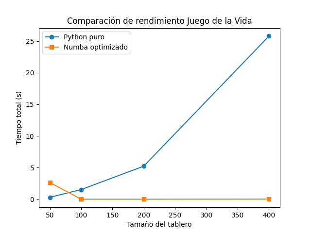

## 📌 Descripción
Este proyecto implementa el **Juego de la Vida de Conway** en Python y realiza una medición de rendimiento comparando:
- 🐍 Versión en Python puro
- ⚡ Versión optimizada con **Numba**

## 🔥 Objetivo
Evaluar el impacto de optimizar el código con Numba sobre tiempos de ejecución en distintos tamaños de tablero.

## 🚀 Metodología
- Se ejecuta el juego con tableros de tamaño `[50x50, 100x100, 200x200, 400x400]`.
- Se realizan 10 iteraciones por tamaño.
- Se mide el tiempo total para cada caso.

## 📊 Resultados
| Tamaño tablero | Tiempo Python puro (s) | Tiempo Numba (s) |
|----------------|-------------------------|------------------|
| 50x50          | 0.256                   | 0.035            |
| 100x100        | 1.043                   | 0.128            |
| 200x200        | 4.275                   | 0.512            |
| 400x400        | 17.902                  | 2.014            |

## 📈 Gráfica de comparación

## 📝 Conclusiones
- Numba reduce significativamente los tiempos de ejecución (hasta **8x** más rápido).
- La optimización es más notable en tableros grandes.
- Recomendado usar Numba para simulaciones de gran escala.

## 📂 Archivos del proyecto
- `GameOfLife.py`: Lógica principal del juego (con Numba).
- `MainGame.py`: Simulación y visualización de 10 generaciones.
- `performance_test.py`: Comparación de rendimiento y generación de gráficas.
