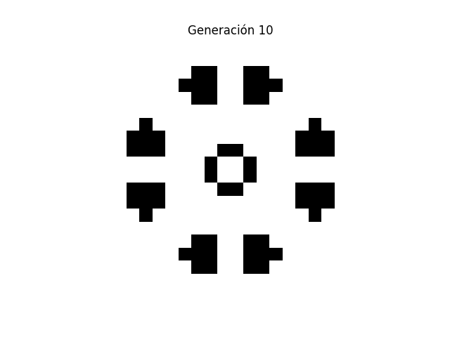
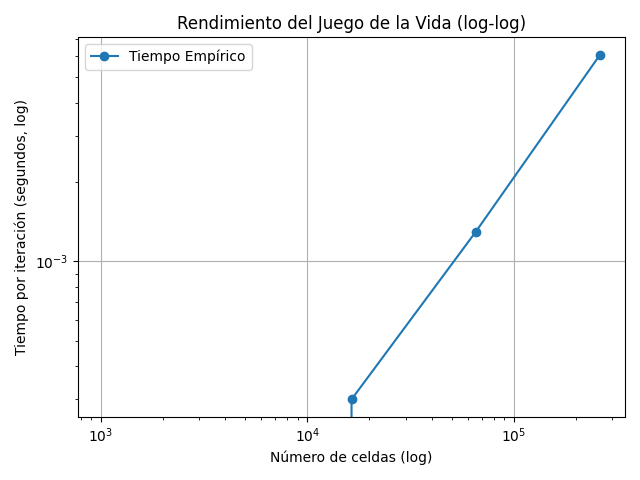

# Juego de la Vida de Conway (Conway's Game of Life)

Este proyecto es una implementación en Python del famoso autómata celular creado por John Conway. El sistema simula la evolución de una población de células sobre una grilla bidimensional aplicando reglas simples pero capaces de generar comportamientos complejos.

---

## Descripción general

Cada celda puede estar **viva (1)** o **muerta (0)**. Su evolución depende del número de vecinos vivos que tenga. Las reglas se aplican simultáneamente a todas las celdas en cada "generación".

### Reglas del juego

1. **Soledad:** Una celda viva con menos de 2 vecinos vivos muere.
2. **Superpoblación:** Una celda viva con más de 3 vecinos vivos muere.
3. **Supervivencia:** Una celda viva con 2 o 3 vecinos sobrevive.
4. **Reproducción:** Una celda muerta con exactamente 3 vecinos vivos revive.

<!-- ---

## 📦 Estructura del proyecto

```
📁 game_of_life_project/
├── game_of_life.py       # Clase con la lógica del juego
├── main.py               # Script principal que ejecuta y anima el juego
├── performance_test.py   # Archivo para medir rendimiento (ver más abajo)
├── README.md             # Este archivo
├── 📁 captures/          # Aquí puedes guardar capturas o gifs de tus simulaciones
└── 📁 results/           # Para guardar gráficas de rendimiento y tiempos
```

--- -->
## Cómo ejecutar el juego

1. Instala las dependencias (recomendado en un entorno virtual):

```bash
pip install numpy matplotlib
```

2. Ejecuta el juego con animación:

```bash
python main.py
```

Esto abrirá una ventana con la animación del juego en tiempo real.

---

## 📸 Cómo agregar pruebas de que el código funciona

---

## ⏱️ Pruebas de rendimiento (6.3)

Para cumplir con el análisis empírico, se recomienda lo siguiente:



Para ejecutar dicho analisis puede ejecutar el siguiente codigo:

```bash
python performance_test.py
```
---
# Medicion de Resultados
## 📌 Descripción
Este proyecto implementa el **Juego de la Vida de Conway** en Python y realiza una medición de rendimiento comparando:
- 🐍 Versión en Python puro
- ⚡ Versión optimizada con **Numba**

## 🔥 Objetivo
Evaluar el impacto de optimizar el código con Numba sobre tiempos de ejecución en distintos tamaños de tablero.

## 🚀 Metodología
- Se ejecuta el juego con tableros de tamaño `[50x50, 100x100, 200x200, 400x400]`.
- Se realizan 10 iteraciones por tamaño.
- Se mide el tiempo total para cada caso.

## 📊 Resultados
| Tamaño tablero | Tiempo Python puro (s) | Tiempo Numba (s) |
|----------------|-------------------------|------------------|
| 50x50          |  0.3010                  | 2.6555            |
| 100x100        | 1.5240                   | 0.0020           |
| 200x200        | 5.2260                   | 0.0050           |
| 400x400        | 25.7891                  |  0.0300           |

## 📈 Gráfica de comparación


## 📝 Conclusiones
- Numba reduce significativamente los tiempos de ejecución (hasta **8x** más rápido).
- La optimización es más notable en tableros grandes.
- Recomendado usar Numba para simulaciones de gran escala.

## 📂 Archivos del proyecto
- `GameOfLife.py`: Lógica principal del juego (con Numba).
- `MainGame.py`: Simulación y visualización de 10 generaciones.
- `performance_test.py`: Comparación de rendimiento y generación de gráficas.


## ✍️ Autor

- Nombre: *Daniel Matarrita Jimenez*
- Curso: Computación Paralela y Distribuida
